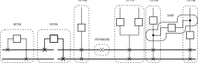
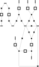
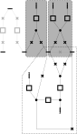
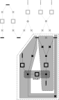

== Detect cells

=== Definitions and goal
An object of `Cell` class represents a connected subgraph of nodes that participate to a common purpose. The goal of the cell detection is to create these subgraphs that will then:

* structures the organisation of the busbars layout
* be displayed according to their types

Two subclasses inherit the `Cell` class :

* `InternCell` for cells that does not contain `FeederNode` nodes and are not shunting external cells,
* `ExternCell` for cells connecting `FeederNode` nodes to `BusNode` nodes.

Cells can be of one of the following enum `CellType`:

`INTERN`::
The smallest subGraph delimited by `BusNode` nodes (ie not including `FeederNode`.) +
Such a cell instanciates the `InternCell` subclass

`INTERNBOUND`::
A singular intern Cell having exactly 3 nodes: 1 `SwitchNode` node connecting 2 neighboring (ie having the same vertical position, and having contiguous horizontal values) `BusNode` nodes  +
Such a cell instanciates the `InternCell` subclass

`EXTERN`::
The smallest subGraph delimited by `BusNode` nodes and `FeederNode` nodes with at least one node having a "bottleneck property" defined as: each branch extracted from this very node ends with nodes of a single `nodeType` among:`BUS` or `FEEDER` or `SHUNT` +
 Such a cell instanciates the `ExternCell` subclass

`SHUNT`::
A path between 2 `FictitiousNode` nodes of 2 `ExternCell` cells +
Such cell instanciates the `Cell` class

`UNDEFINED`::
Initial type, should not stay as is.

.CellTypes enum

=== Implementations
==== The `ImplicitCellDetector` class
The ImplicitCellDetector implements the algorithm according to the above definitions.

===== Cleaning
The first step consists in calling some cleaning and tuning operations of the `Graph` class.

* `Graph.removeUnnecessaryFictitiousNodes()` is optionally called to simplify the graph by removing redundant `FicticiousNode` nodes
* `Graph.extendFeederWithMultipleSwitches()` is systematically called to insert a `FictitiousNode` node to a `FeederNode` node when it is originally connected to many `SwitchNode` nodes as graphically, a `FeederNode` shall be connected to one and only one Node.
* `Graph.extendFirstOutsideNode()` copes with the case of a string of 2+ `SwitchNode` nodes starting from a `NodeBus` node. In that case a `FicticiousNode` node need to be applied to align the connection of the second `SwitchNode` at the `LayoutParameters.stackHeight`
* `Graph.extendBreakerConnectedToBus()` copes with a breaker directly connected to the `NodeBus` node. A fictitious switch is inserted in between.
* `Graph.extendFeederConnectedToBus()` copes with `FeederNode` node directly connected to the `NodeBus` node. A `FictitiousNode` node is inserted in between.

==== Cell detection algorithm
===== Steps

The algorithm will be explained based on the following graph would result in the figure displayed to illustrate the cellTypes enum:

* step 1 calls twice the `genericDetectCell` method to identify:
.. the `InternCell` cells
.. other consistent subgraphs that will be analysed in step 2
* step 2 identifies the consistent subgraphs that are ExternCell
* step 3 tries to separates each consistent subgraph into :
** 2 `ExternCell` cells bound by
** 1 `Cell` cell constituting a shunt

Steps 1 and 3 make use of the recursive method `rDelimitedExploration` to visit the graph

CAUTION: Any other pattern is not handled by the algorithm.

===== the method `rDelimitedExploration`

`rDelimitedExploration` visits the graph and collapse each nodes of the path to constitute a connected subgraph according to criteria on nodes. Each node visited is added to the `exploredNodes` list that constitutes the list of nodes that shall not be visited again. It takes as parameter two lists of types. The traversal algorithm :

* ends the current branch when reaching a node whose type is in the `stopTypes` list
* invalidates the traversal if reaching a node whose type is in the `exclusionTypes` list.

.Use of the `rDelimitedExploration` method
|====
|Where |ExclusionTypes |StopTypes
|`genericDetectCell` called in step 1 to identify the internal cells|`FEEDER` |`BUS`
|`genericDetectCell` called in step 1 to identify other consistent subgraphs |- |`FEEDER` and `BUS`
|called in step 3 in the process of identifying nodes of nodeType `SHUNT` |`BUS`, `SHUNT` and `FEEDER` | -
|====

===== Step 1: Split the graph and identify `InternCell` cells
The `FEEDER` and `BUS` node types constitute borders of cells or consistent subgraphs. When the algorithm reaches one of them, it either stops the branch, or invalidates the graph traversal.

`InternCell` cells are easy to determine as being exclusively bordered by `BUS` nodes.

image::images/rawGraphIntern.svg[align="center"]

==== Step 2: identifies `ExternCell` cells
If one node of the subgraph has each of branchs connected to it ending with one single kind of `NodeType` among `BUS` and `FEEDER`, this is an `ExternCell`.

Other `ExternCell` cells could be discovered in the next steps when adding the `SHUNT NodeType`.

===== step 3: discriminates `EXTERN` and `SHUNT` cells
To identify the first candidate `SHUNT` node, each `FICTITIOUS` node with more than 3 branches are visited. The expected property of the `SHUNT` node is that:

. 1+ branch(s) is ending with only `BUS` nodes
. 1+ branch(s) is ending with only `FEEDER` nodes
. 1 branch is ending with `FEEDER` and `BUS` nodes.

The branches of the first two categories constitues the first `ExternCell` cell.

Then the `SHUNT` cell is constituted of:

* the first `SHUNT` node
* the string of nodes that have only 2 adjacent nodes
* the first node with more than 2 adjacent nodes that becomes the second `SHUNT` node

Last, the second `ExternCell` cell is build with the second `SHUNT` node and the remaining nodes.

'''
==== The `PatternCellDetector` class

    *Deprecated*
This detector is based on pattern matching algorithm. The patterns are described in `/resources/pattern.xml`